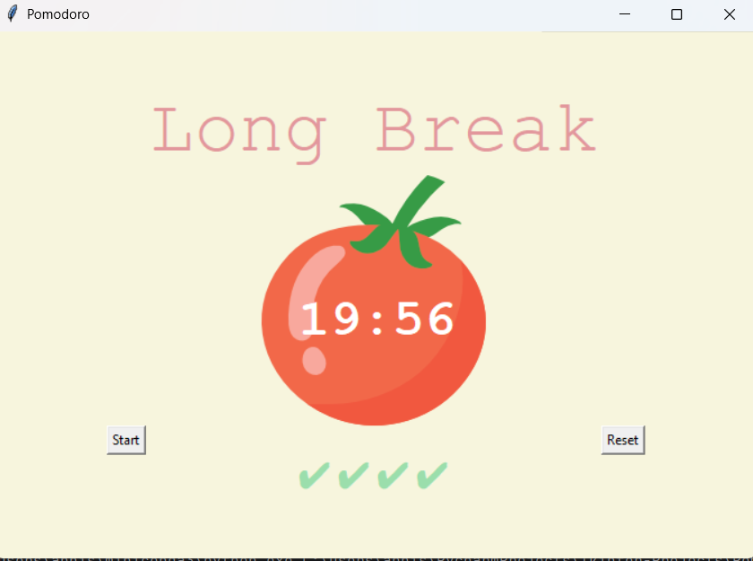

# Pomodoro Timer ⏳  

A **simple yet powerful Pomodoro Timer** built using **Tkinter in Python** to boost productivity. This timer follows the **Pomodoro Technique**, helping you stay focused while ensuring regular breaks to prevent burnout.  

## 🚀 Features  
- **Work Mode (25 min)** – Stay focused and productive.  
- **Short Break (5 min)** – Take quick recovery breaks.  
- **Long Break (20 min)** – Recharge after four work sessions.  
- **Automatic Mode Switching** – The timer transitions seamlessly between work and break sessions.  
- **Session Tracker** – Displays checkmarks (✔) for completed work sessions.  
- **Reset Functionality** – Restart the timer anytime.  

## 🎯 How It Works  
1. Click **Start** – The timer begins in **Work Mode (25 minutes).**  
2. After 25 minutes, it automatically switches to **Short Break Mode (5 minutes).**  
3. After four work sessions, the timer enters **Long Break Mode (20 minutes).**  
4. **Checkmarks (✔) appear** for each completed work session.  
5. Click **Reset** to stop and restart the timer at any point.  

## 🛠 Tech Stack  
- **Python** – Backend logic.  
- **Tkinter** – GUI framework for the timer.  

## 📦 Installation & Usage  

### Prerequisites  
Ensure you have **Python** installed. Download it from [here](https://www.python.org/downloads/).  

### Steps to Run the Pomodoro Timer  
1. **Clone the repository** from GitHub.  
2. **Navigate to the Pomodoro folder** inside the Repo.  
3. **Run the script** using Python.  

## 🖼️ UI Preview  

## 🔮 Future Enhancements  
- **Customizable session times** – Allow users to adjust work/break duration.  
- **Sound alerts** – Notify when a session ends.  
- **Dark mode support** – Enhance usability at night.  

## 💡 Why Pomodoro?  
The **Pomodoro Technique** is a scientifically proven productivity method that balances focus and relaxation. By alternating between deep work and strategic breaks, you can **improve concentration, reduce burnout, and enhance efficiency**.  

🚀 **Try it out and supercharge your workflow!**  

---  
 
📢 **Let's connect!** Share your feedback and improvements.
